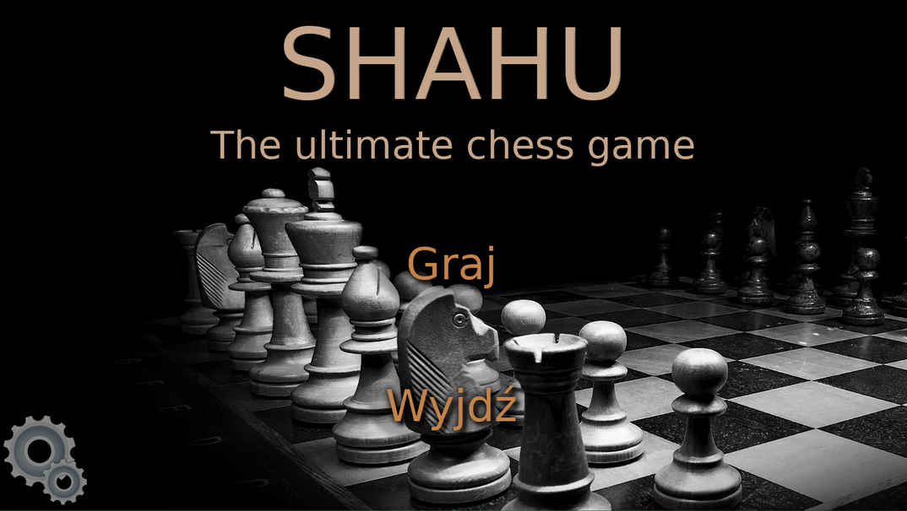

# TEST PAGE

Hi, I am an IT student trying some *new* things out. Good to see you here.

## My Projects
### Shahu
Shahu is a state of the art chess simulator. It allows players to dive into incredible world of pawns, farsighted tactics and time management. Thanks to recent advancements in the area of machine learning, big data and artificial intelligence, gamers are able to face one of the most complex and sophisticated AI alghoritms available*. All of this can be experienced in high framerates (240FPS) and crisp, colorful, two-dimensional graphics.

*This claim is disputed.
'https://github.com/senior-cpp-developer/senior-cpp-developer.github.io/raw/main/shahu-mainMenu.png'
